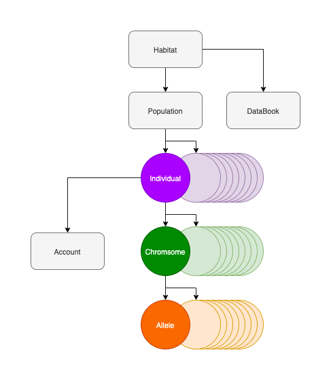

# SeniorDesign_V0

## Table Of Contents
- Introduction
- Project Breakdown
- Development 
- Installation
- Running Simulations
- Licensing

## Introduction
- Theory
```
Due to the difficulty in short-term forecasting of stock price based on technical indicators,
it is increasingly difficult to associate specific, or groups of, technical indicator signals 
to the fluctuating price of a stock; furthermore, considering that the signal, and relationship 
between these signals, can change overtime then it is exponentially more difficult to forecast 
short-term performance of any given stock. Therefore, due to the adaptive nature of evolutionary 
algorithms over time, an approach using a tailored genetic algorithm to this paradigm will be 
effective at determining: valuable technical signals, constructive groupings of these signals,
intelligent weighting of signals within groups and threshold values for grouped signals. 
Ultimately, resulting in a genetically programmed trading bot that predicts the price movement 
of a given stock to provide returns that result in a consistent positive monthly ROI.
```
- Applications
```
1.
2.

```

## Project Breakdown
- Directory Structure
```
+ data
    + driver
    + pure
    + raw
+ genetics
    + allele
    + chromosome
+ phenetics
    + account
    + individual
+ simulation
    + habitat
    + population
+ test
    - 'miscellaneous test classes'
+ venv
main.py
README.md
```

- Class Diagram
```
```

```
```

- UML Diagram
```

```
- Class Breakdown
```

```
## Development
- Current Updates
```
01-10-2020 : First prototype complete! Needs technical indicators.
...
```
- To-do List
```
- ...
- ...
```
- Future Milestones
```
- ...
```

## Running The Program
Installation :
```
1. What is step 1
2. What is step 2
3. What is step 3
4. What is step 4
5. What is step 5
```
Trouble Shooting :
```
- problem a : description
    1. steps...
- problem b : description
    1. steps...

```
Dependencies :
```
- ...
```
Running Simulations :
```
- ...
```

## License
private

## References
```
[1] ...
[2] ...
```